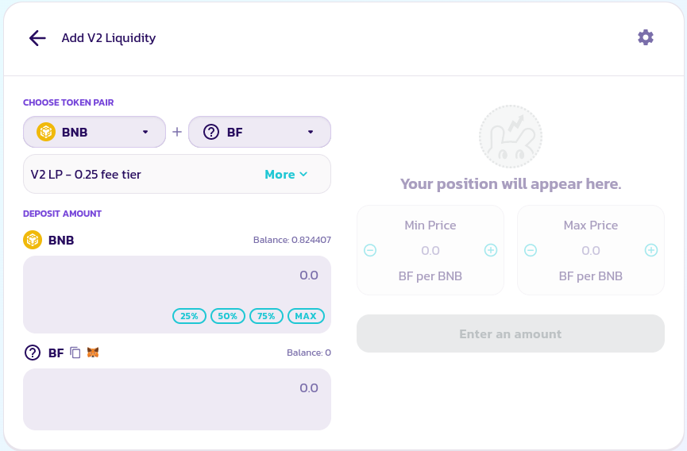

# About This Project.
Bsc fly is a Fair Mint && Stake && Reward defi game.Inspired by brc20 fair launch

It provid An Absolutely Fair Way to Issue Tokens.

## Token Economic Model
### The Max
Total 42000000 BF token.

### For open Mint
2100000 for open mint for every one, 1000/ person.

### For Staking Reward
every one can add Liquidity on pancakeswap v2, and stake LP tokens for Liquidity Staking Reward.

The Staking program Fully Decentralized, everyone can stake and unstake at anytime.

### How Long the Staking rewards?
on bsc about 6 years to fully distributed the 21 000 000 BF token for staker.

## How to start?
1. Metamask
    - open https://bscfly.ermiasscott.fun/
    - connet wallet use metamask. (On desktop computer)
    - If you use tokenpoket or other wallet on mobile, just copy https://bscfly.ermiasscott.fun/ to wallet expoler, and connet wallet use metamask.
    - 
2. BNB
    make sure your account have BNB > 0.1

3. Mint Token
click the button to mint 1000 Token, every address can only mint  1000.

4. Add Liquidity On Pancakeswap.
click this section will auto goto pancakeswap 

Note: Only add V2 Pool, We only support LP V2 Token Stake Rewards.

5. Stake LP Token 

If You successed add Liquidity on pancakeswap at step 4. Your LP Not Staked Balance: 0.1 Cake-LP will Not be zero.
Like this.

and Now You need to click Approve Button to approve stake contract can stake LP TOKEN.

Wait some seconds for the transaction comfire on blockchain.

Input Your LP token amount you need to stake. and clicke Stake Now Button

6. Trade On Pancakeswap

7. Claim Rewards

8. Withdraw LP Token and Exit Stake

9. Buy or Sell BF token on pancakeswap.

